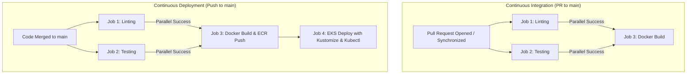

# CI/CD Pipeline Implementation & Submission Guide

This repository contains the complete Continuous Integration (CI) and Continuous Deployment (CD) pipelines built with **GitHub Actions** for the **Movie Picture Pipeline** application (Frontend React App & Backend Flask API), deployed to **Amazon EKS** with container images stored in **Amazon ECR**.

---

## 📋 Table of Contents
1. [Project Architecture](#project-architecture)
2. [Workflows Overview](#workflows-overview)
3. [Required GitHub Secrets](#required-github-secrets)
4. [Pipeline Triggers & Execution](#pipeline-triggers--execution)
5. [Testing Failure Simulations](#testing-failure-simulations)
6. [Deployment Verification](#deployment-verification)
7. [Standout Features & Optimizations](#standout-features--optimizations)

---

## 🏗️ Project Architecture



---

## 🚀 Workflows Overview

### 1. Frontend CI (`.github/workflows/frontend-ci.yaml`)
- **Workflow Name:** `Frontend Continuous Integration`
- **Triggers:**
  - Pull requests targeting branch `main` modifying `starter/frontend/**`
  - Manual execution via `workflow_dispatch`
- **Jobs:**
  - `lint`: Checks code formatting and ESLint rules (`npm run lint`)
  - `test`: Executes React unit tests (`npm run test`) with `CI=true`
  - `build`: Depends on `[lint, test]` (`needs: [lint, test]`), builds the Docker container with `docker build`

### 2. Backend CI (`.github/workflows/backend-ci.yaml`)
- **Workflow Name:** `Backend Continuous Integration`
- **Triggers:**
  - Pull requests targeting branch `main` modifying `starter/backend/**`
  - Manual execution via `workflow_dispatch`
- **Jobs:**
  - `lint`: Checks Python code styling with flake8 (`pipenv run lint`)
  - `test`: Executes Pytest test suite (`pipenv run test`)
  - `build`: Depends on `[lint, test]` (`needs: [lint, test]`), builds the Docker image with `docker build`

### 3. Frontend CD (`.github/workflows/frontend-cd.yaml`)
- **Workflow Name:** `Frontend Continuous Deployment`
- **Triggers:**
  - Push/merge to branch `main` modifying `starter/frontend/**`
  - Manual execution via `workflow_dispatch`
- **Jobs:**
  - `lint` & `test`: Run concurrently to ensure quality
  - `build`:
    - Only runs after lint & test pass (`needs: [lint, test]`)
    - Injects backend API URL via `--build-arg REACT_APP_MOVIE_API_URL="${{ secrets.REACT_APP_MOVIE_API_URL }}"`
    - Logs into AWS ECR using official `aws-actions/amazon-ecr-login@v2`
    - Tags Docker image with commit SHA (`${{ github.sha }}`) and `latest`
    - Pushes image to Amazon ECR
  - `deploy`:
    - Runs after build completes (`needs: [build]`)
    - Authenticates to AWS and configures `kubectl` via `aws eks update-kubeconfig`
    - Uses `kustomize edit set image` to update image reference to ECR repository + Git SHA
    - Applies manifests with `kustomize build . | kubectl apply -f -`
    - Verifies deployment with `kubectl rollout status`

### 4. Backend CD (`.github/workflows/backend-cd.yaml`)
- **Workflow Name:** `Backend Continuous Deployment`
- **Triggers:**
  - Push/merge to branch `main` modifying `starter/backend/**`
  - Manual execution via `workflow_dispatch`
- **Jobs:**
  - `lint` & `test`: Run in parallel to ensure code quality
  - `build`:
    - Only runs after lint & test pass (`needs: [lint, test]`)
    - Logs into AWS ECR securely using `aws-actions/amazon-ecr-login@v2`
    - Tags Docker image with commit SHA (`${{ github.sha }}`) and `latest`
    - Pushes image to Amazon ECR
  - `deploy`:
    - Runs after build completes (`needs: [build]`)
    - Authenticates to AWS and configures `kubectl`
    - Uses `kustomize edit set image` to set image tag to the Git SHA
    - Applies manifests to Kubernetes cluster
    - Verifies deployment with `kubectl rollout status`

---

## 🔐 Required GitHub Secrets

To run the workflows successfully in your GitHub repository, configure the following secrets under **Settings > Secrets and variables > Actions**:

| Secret Name | Description | Example / Source |
|---|---|---|
| `AWS_ACCESS_KEY_ID` | AWS Access Key for IAM User `github-action-user` | Created from IAM Console |
| `AWS_SECRET_ACCESS_KEY` | AWS Secret Access Key for IAM User `github-action-user` | Created from IAM Console |
| `AWS_REGION` | Target AWS Region | `us-east-1` |
| `EKS_CLUSTER_NAME` | EKS Cluster Name | `cluster` (Terraform output) |
| `FRONTEND_ECR_REPOSITORY` | Frontend ECR Repository Name | `frontend` |
| `BACKEND_ECR_REPOSITORY` | Backend ECR Repository Name | `backend` |
| `REACT_APP_MOVIE_API_URL` | Backend Service Endpoint for React Frontend | `http://<backend-k8s-service-or-alb-url>:5000` |

> [!IMPORTANT]
> **No AWS Credentials Hardcoded**: All credentials and sensitive connection parameters are accessed strictly through GitHub Secrets as required by the security criteria.

---

## 🧪 Testing Failure Simulations

The project includes built-in hooks to test that pipelines fail appropriately when errors are present:

### 1. Frontend Failure Simulation
- **Lint Failure:**
  Set `FAIL_LINT=true` in `starter/frontend/.eslintrc.js` or run:
  ```bash
  FAIL_LINT=true npm run lint
  ```
- **Test Failure:**
  Set `FAIL_TEST=true` in environment or command:
  ```bash
  FAIL_TEST=true CI=true npm test
  ```

### 2. Backend Failure Simulation
- **Lint Failure:**
  Run `pipenv run lint-fail` or introduce lines longer than 88 characters.
- **Test Failure:**
  Run test with `FAIL_TEST=true`:
  ```bash
  FAIL_TEST=true pipenv run test
  ```

---

## 🌐 Deployment Verification

Once deployed to Kubernetes, verify the services and deployments:

```bash
# Check pod status
kubectl get pods -n default

# Check service endpoints
kubectl get svc -n default

# Verify Backend API returns movie list
curl http://<BACKEND_SERVICE_IP_OR_HOST>:5000/movies
# Expected response:
# {"movies":[{"id":"123","title":"Top Gun: Maverick"},{"id":"456","title":"Sonic the Hedgehog"},{"id":"789","title":"A Quiet Place"}]}

# Verify Frontend is reachable
curl http://<FRONTEND_SERVICE_IP_OR_HOST>:3000
```

---

## ⭐ Standout Features & Best Practices

1. **Custom Reusable Composite Actions**:
   - `.github/actions/setup-frontend/action.yaml`: Modular action to configure Node.js, restore npm cache, and install dependencies.
   - `.github/actions/setup-backend/action.yaml`: Modular action to configure Python, restore pipenv cache, and install dependencies.
2. **Dependency & Build Caching**:
   - `actions/cache@v4` implemented across all workflows for npm (`~/.npm`) and Python/Pipenv (`~/.cache/pip`, `~/.local/share/virtualenvs`), reducing CI run times significantly.
3. **Immutability & Traceability**:
   - Docker images are tagged with exact Git commit SHAs (`${{ github.sha }}`) ensuring full auditability and rollback capability in Kubernetes.
4. **Dynamic Manifests via Kustomize**:
   - Decoupled manifest configurations that avoid hardcoding environment-specific image tags in Git.
